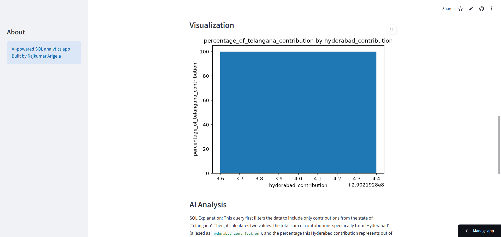

# AI SQL Data Analyst 2.0

AI SQL Data Analyst 2.0 is an AI-powered data analytics application that enables users to analyze structured datasets using natural language. Users can upload any CSV file, ask analytical questions in plain English, and receive automatically generated SQL queries, query results, visualizations, KPI summaries, and AI-generated business insights.

**Live Demo**  
https://ai-sql-data-analyst-2pz9k4b6xdg6vfmi4qyx3i.streamlit.app/

**GitHub Repository**  
https://github.com/RajkumarArigela/AI-SQL-Data-Analyst

---

# Overview

The application simplifies SQL-based data analysis by allowing users to interact with their datasets conversationally. It combines Large Language Models (Google Gemini), SQLite, and Streamlit to automatically generate SQL queries, execute them safely, visualize the results, and provide meaningful business insights.

---

# Key Features

- Upload any CSV dataset
- Automatic CSV to SQLite conversion
- Natural language to SQL generation using Google Gemini
- SQL query validation before execution
- Automatic SQL execution
- Interactive result visualization
- KPI dashboard
- AI-generated SQL explanation
- AI-generated business insights
- Suggested follow-up analytical questions
- Error handling and validation
- Web-based interface built with Streamlit

---

# System Architecture

```
                 CSV Dataset
                      │
                      ▼
              Pandas DataFrame
                      │
                      ▼
             SQLite Database
                      │
                      ▼
        Natural Language Question
                      │
                      ▼
         Gemini AI SQL Generation
                      │
                      ▼
             SQL Validation Layer
                      │
                      ▼
              SQLite Execution
                      │
                      ▼
               Query Results
                      │
      ┌───────────────┼───────────────┐
      ▼               ▼               ▼
 KPI Dashboard   Visualization   AI Analysis
                                       │
          ┌────────────────────────────┼───────────────────────────┐
          ▼                            ▼                           ▼
 SQL Explanation             Business Insights         Follow-up Questions
```

---

# Project Structure

```
AI-SQL-Data-Analyst/
│
├── app.py
├── database.py
├── llm_sql.py
├── validator.py
├── analyst_ai.py
├── charts.py
├── requirements.txt
├── README.md
├── .gitignore
├── data/
└── screenshots/
```

---

# Technology Stack

| Category | Technologies |
|----------|--------------|
| Programming Language | Python |
| Web Framework | Streamlit |
| Database | SQLite |
| Data Processing | Pandas |
| Large Language Model | Google Gemini |
| AI Framework | LangChain |
| Visualization | Matplotlib |
| Version Control | Git, GitHub |

---

# Installation

Clone the repository

```bash
git clone https://github.com/RajkumarArigela/AI-SQL-Data-Analyst.git
```

Navigate to the project directory

```bash
cd AI-SQL-Data-Analyst
```

Create a virtual environment

```bash
python -m venv venv
```

Activate the virtual environment

**Windows**

```bash
venv\Scripts\activate
```

**Linux / macOS**

```bash
source venv/bin/activate
```

Install dependencies

```bash
pip install -r requirements.txt
```

---

# Configuration

Create a `.env` file in the project root and add your Google Gemini API key.

```env
GOOGLE_API_KEY=YOUR_GEMINI_API_KEY
```

---

# Running the Application

```bash
streamlit run app.py
```

---

# Application Screenshots

## Home Page


---

## SQL Generation and Query Results


---

## Data Visualization



---

## AI Business Analysis


---

## Suggested Follow-up Questions


---

# Example Questions

- Which state has the highest total investment?
- Show total investment by city.
- What is the average investment by gender?
- Which payment mode is used the most?
- Which age group invests the most?
- Show KYC completed investors by state.
- Which city tier contributes the highest investment?
- What is the average annual income by state?
- Which transaction type is the most common?
- Show the top 10 investors by investment amount.

---

# Application Workflow

```
Upload CSV Dataset
        │
        ▼
Create SQLite Database
        │
        ▼
Ask Analytical Question
        │
        ▼
Generate SQL Query
        │
        ▼
Validate SQL
        │
        ▼
Execute SQL
        │
        ▼
Display Query Results
        │
        ▼
Generate Visualizations
        │
        ▼
Display KPI Dashboard
        │
        ▼
Generate AI Insights
        │
        ▼
Suggest Follow-up Questions
```

---

# Skills Demonstrated

- Python Development
- SQL and SQLite
- Data Analysis
- Prompt Engineering
- Streamlit Application Development
- LangChain Integration
- Google Gemini API Integration
- Large Language Model Applications
- Data Visualization
- Error Handling
- Git and GitHub

---

# Future Enhancements

- Support for multiple datasets
- Automatic relationship detection between tables
- Query history
- Export reports to PDF and Excel
- User authentication
- Interactive dashboards
- Conversation memory
- Database schema visualization
- PostgreSQL support
- MySQL support
- SQL Server support
- Voice-based analytical queries
- Agentic AI workflow
- Automated report generation
- Predictive analytics

---

# Author

**Rajkumar Arigela**

Email  
therajkumararigela@gmail.com

LinkedIn  
https://www.linkedin.com/in/rajkumar-arigela

GitHub  
https://github.com/RajkumarArigela

---

# License

This project is licensed under the MIT License.
